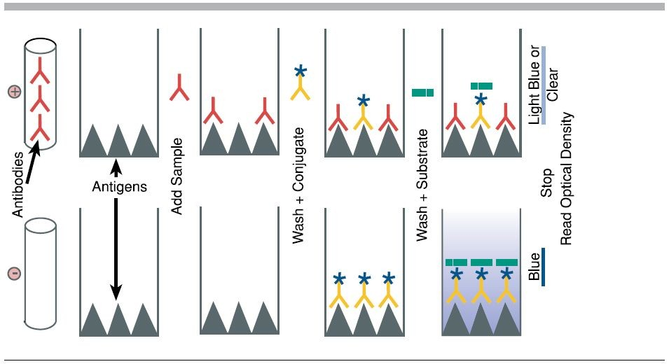

\section{Introduction}

# Harmful Algal Blooms

\begin{columns}
\column{0.5\textwidth}

\begin{itemize}
\item Increase in primary productivity and 
\item growth of microspopic algae and cyanobacteria
\item Toxin-producing genera
\item Decrease biodiversity
\item Anoxic environment
\end{itemize}

\column{0.5\textwidth}
\begin{figure}
\includegraphics[scale=0.2]{../figures/cyano.png}
\end{figure}
\end{columns}

# Toxicity

- Irritant
  - Lipolysacharides\footcite{moore_richard_cyanobacterial_1993}

- Toxins
  - Microcystin and nodularin \textsuperscript{1}
  - Cylindrospermopsin \footcite{dittmann_cyanobacterial_2012}
  - Anatoxin \footcite{codd_cyanobacterial_1999}
  - Saxitoxin \textsuperscript{1}

# Law and Regulation

- Safe Drinking Water Act 
- Maximum Contaminant Level 
  - Regulated and enforced
- Contaminant Candidate List
  - "More like guidelines"

# Objectives

- a
- b

# Surveyed Lakes

{width=80%}

# Methods

# Water Sampling

- Sampled each lake once a month
- Collected water
- Quickly transported back
- Analyzed ASAP

# Analysis

# Coloremetric 
- jflsd

# LC-MS/MS

- a

# ELISA

- Enzyme-linked immunosorben assay
{width = "80%"}

# Geospatial Analysis

- a

# Results

- a

# Could we predict HABs?

- a

- a

# Acknowledgment

- My lab partners Brian Spies and Andrew Herrpich

- Jason Sckrabulis, Ryan Mcwhinnie, Melissa Ostrowski

- Dr. David Szlag and Dr. Thomas Raffel

- Michigan Department Environmental Quality

- Oakland University and the Chemistry Department

