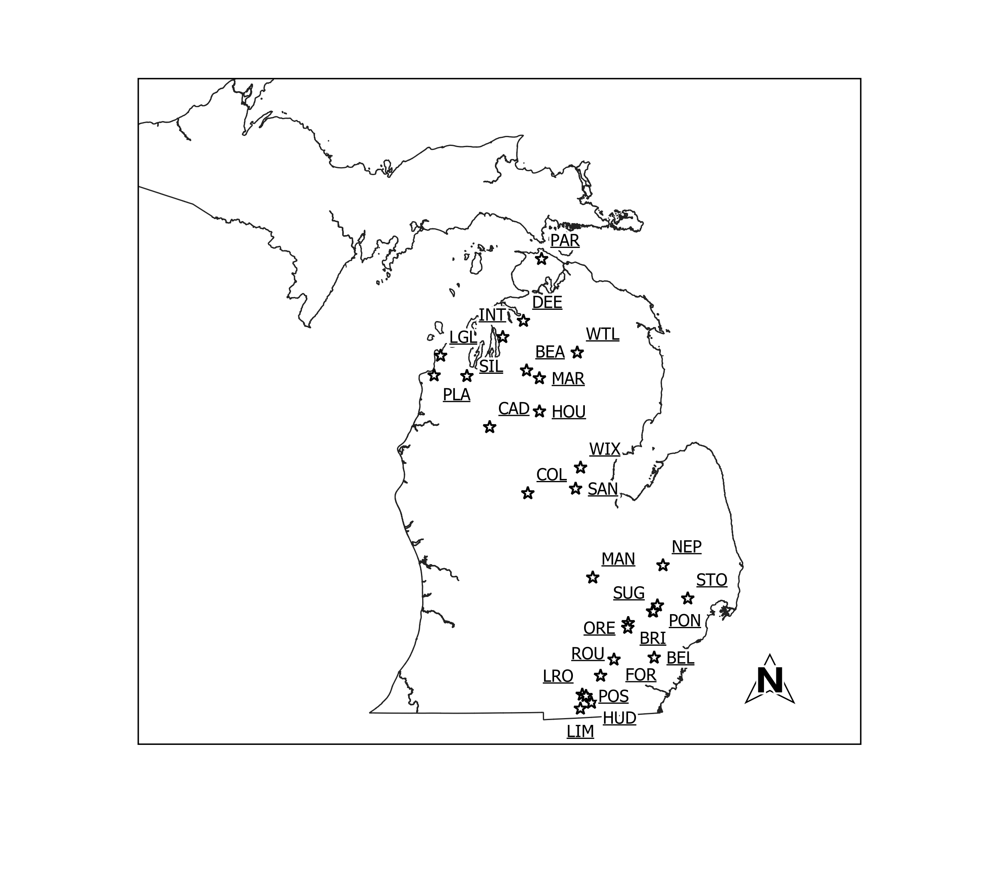

%---------------------------------
\section{Introduction}
%---------------------------------

# Harmful Algal Blooms

- Increase in primary productivity and growth of microspopic algae and cyanobacteria
- Toxin-producing genera
- Decrease biodiversity
- Anoxic environment

\begin{figure}
\centering
\includegraphics[scale=0.2]{../figures/cyano.png}
\end{figure}

# Harm

- Irritant
  - Lipolysacharides
- Toxins
  - Microcystin and nodularin
  - Cylindrospermopsin
  - Anatoxin \footcite{meyer_prerequisites_2017}
  - Saxitoxin \footcite{fontanillo_synthesis_2016}

# Law and Regulation

- Safe Drinking Water Act 
- Maximum Contaminant Level 
  - Regulated and enforced
- Contaminant Candidate List
  - "More like guidelines"

# Objectives

%---------------------------------
\section{Research Survey}
%---------------------------------

\subsection{Goals}

- a
- b

# Surveyed Lakes

{width=80%}

# Methods

\subsection{Methods}

# Water Sampling

- Sampled each lake once a month
- Collected water
- Quickly transported back
- Analyzed ASAP

# Nutrient Analysis

- Coloremetric 
- jflsd

# LC-MS/MS

- a

# ELISA

- a

# Geospatial Analysis

- a

%---------------------------------
\section{Results}
%---------------------------------

# Results

- a

%---------------------------------
\section{Discussion}
%---------------------------------

# Could we predict HABs?

- a

%---------------------------------
\section{Conclusion}
%---------------------------------

- a

# Acknowledgment

- My lab partners Brian Spies and Andrew Herrpich

- Jason Sckrabulis, Ryan Mcwhinnie, Melissa Ostrowski

- Dr. David Szlag and Dr. Thomas Raffel

- Michigan Department Environmental Quality

- Oakland University and the Chemistry Department

